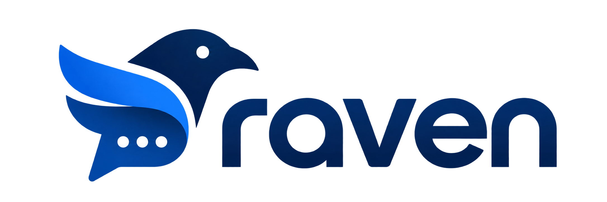
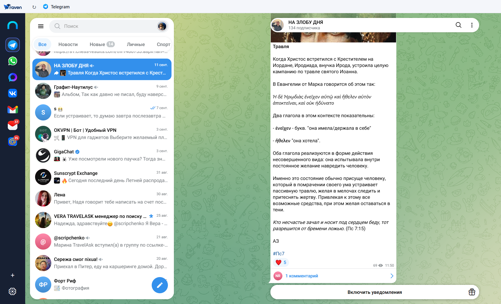
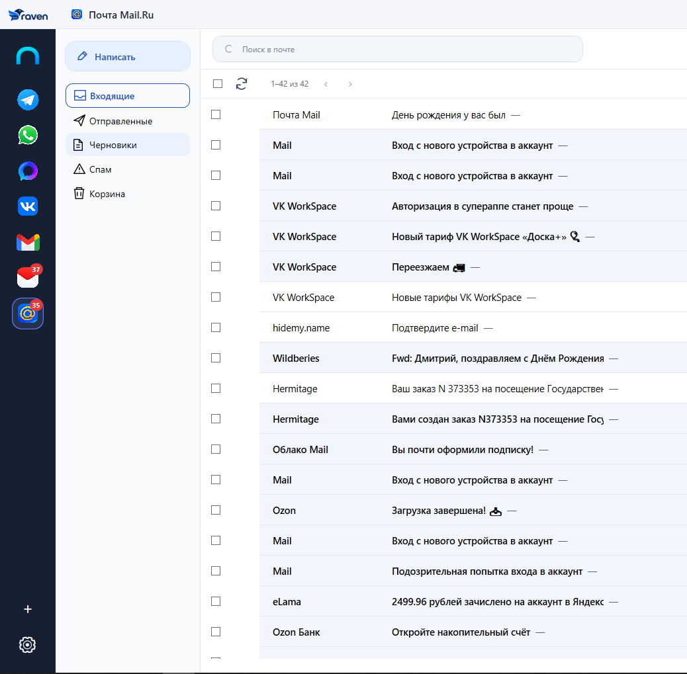
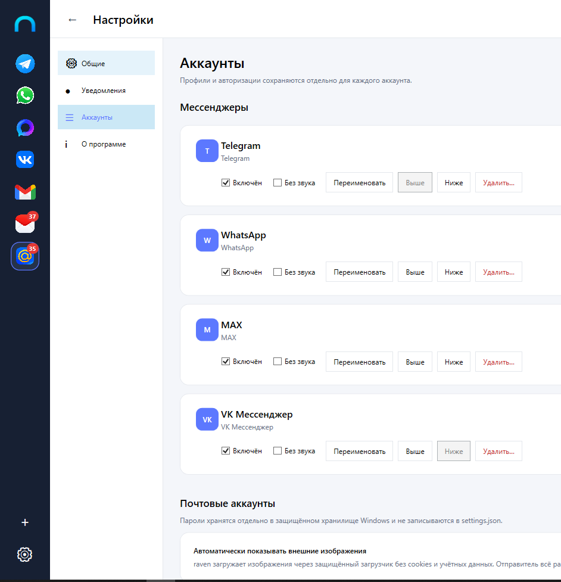

<p align="center">
  
</p>

<p align="center">Мессенджеры и почта в одном окне для Windows.</p>

<p align="center"><a href="README.md">English version</a></p>

<p align="center">
  <a href="https://github.com/scripchenko/raven/releases/latest"></a>
  
  <a href="LICENSE"></a>
</p>

<p align="center"><strong><a href="https://github.com/scripchenko/raven/releases/latest">Скачать последний выпуск</a></strong><br>Текущий выпуск: v0.1.0</p>

raven — приложение для Windows, объединяющее мессенджеры и почтовые аккаунты в одном окне. Сессии веб-мессенджеров и почта доступны в одном месте.

## Скриншоты

<p align="center">
  
</p>

<p align="center">
  &nbsp;
  
</p>

## Поддерживаемые сервисы

| Мессенджеры через официальные веб-приложения | Почта |
| --- | --- |
| Telegram, WhatsApp, MAX, VK | Gmail, Яндекс Почта, Mail.ru, другие аккаунты IMAP/SMTP |

Мессенджеры работают в Microsoft Edge WebView2. Gmail использует Gmail API и авторизацию Google в системном браузере. Яндекс Почта, Mail.ru и другая поддерживаемая почта используют IMAP и SMTP. Доступные папки и действия с письмами зависят от почтового сервера.

## Возможности

- Несколько аккаунтов, в том числе одного сервиса. У каждого аккаунта веб-мессенджера свой сохраняемый профиль WebView2.
- Почтовые папки, чтение писем, вложения, создание писем, ответы и пересылка. Для поддерживаемых провайдеров также доступны поиск на сервере, действия с письмами и сохраняемые черновики.
- Системные уведомления, управление уведомлениями отдельных аккаунтов, общий режим «Не беспокоить» и настройки звука. Для поддерживаемых мессенджеров можно выбрать встроенный или пользовательский звук.
- Системный трей, главная страница и настройки. При закрытии окна raven может продолжить работу в трее.
- Проверка новых стабильных выпусков на GitHub. Пользователь скачивает и устанавливает обновление самостоятельно.
- Открытие внешних ссылок в системном браузере с учётом политики навигации приложения.

## Установка

1. Откройте [последний выпуск](https://github.com/scripchenko/raven/releases/latest).
2. Скачайте установщик raven для Windows x64.
3. Запустите установщик.

Требования:

- Windows 10 версии 1809 или новее либо Windows 11, x64;
- Microsoft Edge WebView2 Evergreen Runtime.

Installer содержит автономную сборку .NET 10. Пользователю **не нужны** .NET SDK и отдельная установка .NET runtime. WebView2 Evergreen устанавливается отдельно и в installer не входит.

raven v0.1.0 пока не подписан цифровой подписью. При запуске установщика Windows SmartScreen может показать предупреждение. Проверяйте, что файл загружен из официального выпуска; не отключайте SmartScreen целиком.

Проект готовит заявку в программу бесплатной подписи кода для открытого ПО SignPath Foundation. Принятие проекта ещё не подтверждено. Подробнее — в разделе [Code signing policy](CODE_SIGNING_POLICY.md).

Для Gmail дополнительно нужен локальный Google Desktop OAuth client JSON, который пользователь предоставляет сам: в installer он не включён. Перед добавлением аккаунта прочитайте [инструкцию по Gmail](docs/gmail-setup.md). Для других почтовых провайдеров может потребоваться пароль приложения и доступ к IMAP/SMTP.

## Локальные данные и конфиденциальность

Настройки и идентификаторы аккаунтов хранятся в `%APPDATA%\UnifiedMessenger`. Профили WebView2, защищённые почтовые учётные данные и другие локальные данные — в `%LOCALAPPDATA%\UnifiedMessenger`. Исторические имена каталогов сохранены для совместимости с существующими аккаунтами и сессиями.

Страницы мессенджеров отображает WebView2. Для работы почты raven получает и обрабатывает содержимое писем через Gmail API или IMAP/SMTP. Почтовые учётные данные защищены Windows DPAPI для текущего пользователя; WebView2 хранит свои данные сессий. Подробнее — в [документе о безопасности](docs/security.md) и [политике конфиденциальности](PRIVACY.md).

## Поддержка

[Написать @dscripchenko в Telegram](https://t.me/dscripchenko).

## Разработка

Для сборки из исходников нужен .NET 10 SDK; для сборки Windows installer — Inno Setup 6. Из корня репозитория:

```powershell
dotnet build UnifiedMessenger.sln --configuration Release
dotnet test UnifiedMessenger.sln --configuration Release
./scripts/build-windows-package.ps1
```

Внутреннее имя исполняемого файла остаётся `UnifiedMessenger.App.exe`. Дополнительная документация: [архитектура](docs/architecture.md), [сборка для Windows](docs/windows-distribution.md), [конфигурация Gmail OAuth для разработки](docs/gmail-oauth-development.md).

## Лицензия

Проект распространяется по [лицензии MIT](LICENSE).

## Code signing policy

raven v0.1.0 пока не подписан. Проект готовит заявку в программу бесплатной подписи кода для открытого ПО SignPath Foundation; принятие проекта не подтверждено.

[Code signing policy](CODE_SIGNING_POLICY.md)
